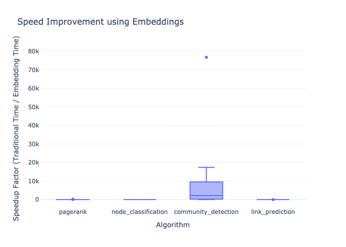
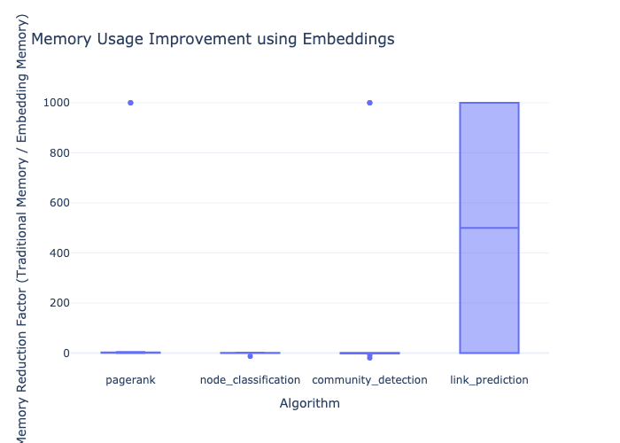
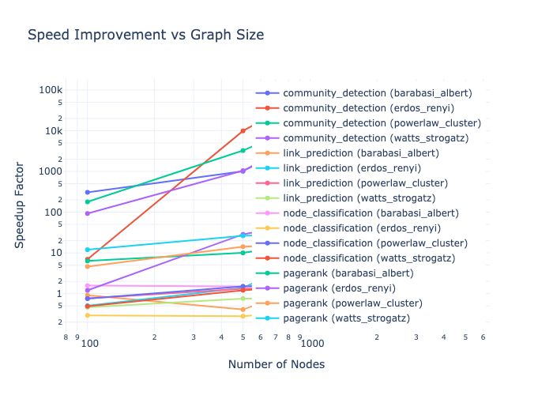
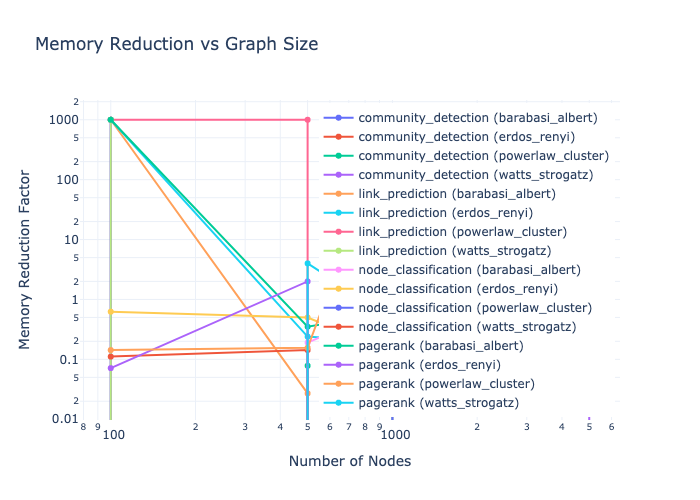
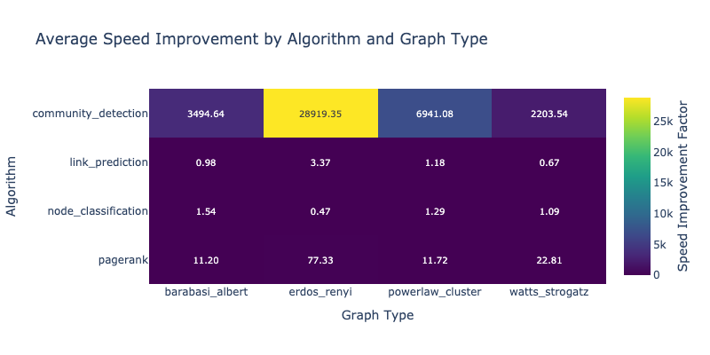
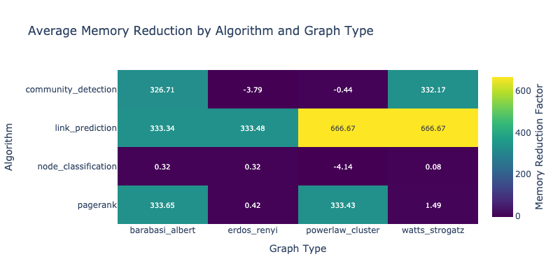

# Performance Benchmarks

This section presents comprehensive benchmarks comparing traditional graph algorithms with their embedding-based counterparts.

## Benchmark Results

Our benchmarking suite measures both time and memory performance across different:
- Graph types (Erdős-Rényi, Barabási-Albert, etc.)
- Graph sizes (100 to 10,000 nodes)
- Algorithms (PageRank, Node Classification, Community Detection, Link Prediction)

### Time Performance

The time performance plots show the speedup factor achieved by using embeddings:
- **Speedup Factor** = Traditional Algorithm Time / Embedding-Based Algorithm Time
- Values > 1 indicate that the embedding-based approach is faster
- Higher values indicate better performance



### Memory Usage

The memory reduction plots show how much memory is saved by using embeddings:
- **Memory Reduction** = Traditional Algorithm Memory / Embedding-Based Algorithm Memory
- Values > 1 indicate that the embedding-based approach uses less memory
- Higher values indicate better memory efficiency



## Scaling Behavior

The scaling plots show how performance changes with graph size:
- X-axis: Number of nodes in the graph (log scale)
- Y-axis: Speedup/Memory reduction factor (log scale)

This helps visualize how embedding-based algorithms maintain their advantage as graphs grow larger.

### Time Scaling


### Memory Scaling


## Performance Heatmaps

The heatmaps provide a comprehensive view of performance across different:
- Graph types
- Graph sizes
- Algorithms

This helps identify which scenarios benefit most from using embeddings.

### Time Performance Heatmap


### Memory Performance Heatmap


## Running Benchmarks

To run the benchmarks yourself:

```bash
# Run the benchmarks
python benchmarks/algorithm_benchmarks.py

# Generate visualizations
python benchmarks/visualize_results.py
```

The results will be saved in `benchmark_results/` with interactive HTML plots in `benchmark_results/plots/`.
